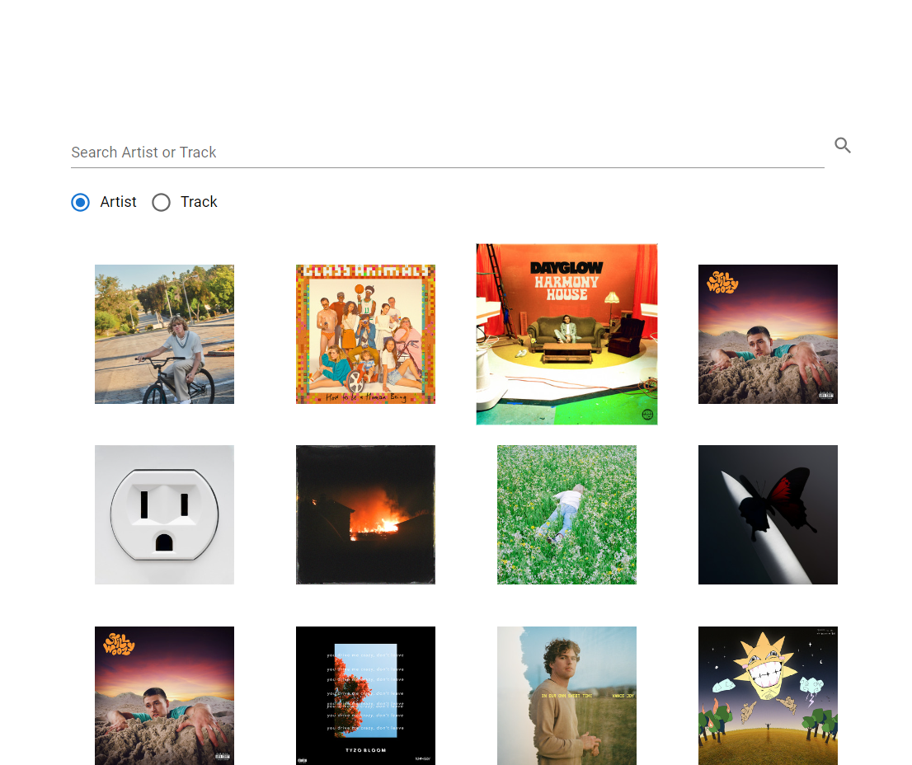

# Spotify Music Recommendation App

[Click here to check out the website](https://fanciful-tulumba-de1b68.netlify.app/)

The Spotify Music Recommendation App is a web application that allows users to discover new music based on a given track or artist. It leverages React, JavaScript, HTML, and Material-UI (MUI) for the user interface and the Spotify Web API for music data retrieval. With this app, users can explore, listen, and add songs to their Spotify playlists.



## Features

- **Spotify Login**: Users can log in to their Spotify accounts to access the full features of the app, including adding songs to their playlists.

- **Search by Track or Artist**: Users can input a track name or artist, and the app will generate a list of recommended songs with album cover images.

- **Song Previews**: Hovering over an album cover image triggers a preview of the song, allowing users to sample the music.

- **Add to Playlist**: Users can add songs to their Spotify playlists directly from the app.

- **Track Details**: Clicking on an album cover image provides detailed information about the track, including artist name, album name, and release date.

## How to run locally

Follow these instructions to get the Spotify Music Recommendation App up and running on your local machine.

### Prerequisites

- Node.js: Make sure you have Node.js installed. You can download it [here](https://nodejs.org/).

### Installation

1. Clone the repository:

   ```bash
   git clone https://github.com/yourusername/spotify-music-recommendation-app.git
   ```

2. Navigate to the project directory:

   ```bash
   cd spotify-music-recommendation-app
   ```

3. Install the dependencies:

   ```bash
   npm install
   ```

### Configuration

To enable Spotify login and access the Spotify Web API, you need to set up a [Spotify Developer App](https://developer.spotify.com/dashboard/.)

You will have to define a '.env' file and set the following variables:

```bash
 PORT=8888
 CLIENT_ID="YOUR_CLIENT_ID"
 CLIENT_SECRET="YOUR_CLIENT_SECRET"
 REDIRECT_URI=http://localhost:8888/callback
```

### Usage

1. Start the development server:

```bash
   npm start
```

2. Open your web browser and visit http://localhost:3000 to use the app.

### Technologies Used

- React: The app is built using the React JavaScript library for building user interfaces.

- JavaScript/HTML: JavaScript and HTML are used for the app's core functionality and structure.

- Spotify Web API: The app retrieves music data from the Spotify Web API, requiring user authentication.

- Material-UI (MUI): MUI is used for designing the user interface, providing a sleek and responsive design.

---

Enjoy discovering and listening to your favorite music with the Spotify Music Recommendation App! 🎶
